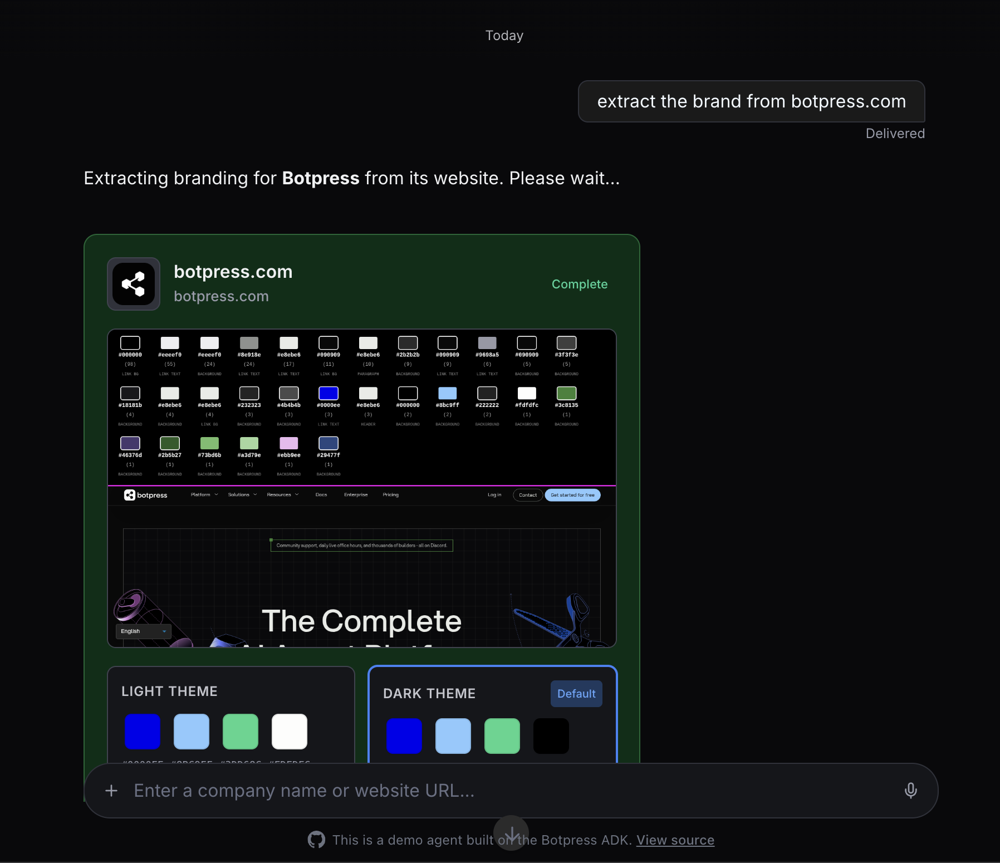

# Brand Extractor

An AI agent that extracts brand colors, logos, and visual identity from any website, producing light and dark theme palettes exportable as CSS, JSON, or Tailwind.

## Demo

Try it live: **[https://brand-extractor.botpress.bot](https://brand-extractor.botpress.bot)**



## Use Case

When you need to reverse-engineer a brand's visual identity from their website — for building themed UIs, generating style guides, or matching a client's branding — this agent automates the entire process. Give it a company name or URL and it returns structured color themes with export options.

## How It Works

The conversation handler starts a background workflow and tracks it via `Reference.Workflow` in conversation state. While the workflow runs, the AI only sees a `stop_extraction` tool; otherwise it sees `start_extraction`.

The workflow runs 6 durable steps:

1. **Find website** — resolves a company name to a URL via web search (short-circuits to URL normalization if given a URL directly)
2. **Discover pages** — searches for pages on the domain, then `zai.filter()` picks the top 3 most visually rich pages (homepage, about, features — not docs or blog posts)
3. **Extract logo** — fetches the site's logo via the browser integration
4. **Take screenshots** — `step.map()` captures all pages in parallel, injecting JavaScript that extracts DOM colors into a visual overlay the vision model can read (see below)
5. **Extract brand** — sends screenshots to a vision model for analysis, then `zai.extract()` parses the description into structured light/dark color themes
6. **Finalize** — assembles everything into the final brand data and updates the progress message

The key trick is in step 4: rather than asking a vision model to guess hex values from pixels (which is unreliable), the injected script reads computed styles from the DOM — button backgrounds, link colors, header colors, etc. — and renders them as labeled color swatches in an overlay bar at the top of the screenshot. The vision model then reads exact hex values from text instead of estimating from pixel colors.

## Key Components

### Brand Extraction Workflow (`bot/src/workflows/index.ts`)

The 6-step durable workflow described above. Uses `zai.filter()` for page selection, `zai.extract()` for structured theme data, `step.map()` for parallel screenshots, and a vision model for screenshot analysis.

### DOM Color Extraction (`bot/src/utils/extract-palette-script.ts`)

JavaScript injected into each page before screenshotting. Walks the DOM, reads computed styles from buttons, links, headers, paragraphs, and background elements, converts RGB to hex, and renders the top 30 colors as labeled swatches in a fixed overlay. This gives the vision model exact hex values to work with.

### Progress Component (`bot/src/utils/progress-component.ts`)

Creates and updates a custom message (`custom://brand_progress`) that the frontend renders as a progress card. Updates have merge semantics so partial step updates don't overwrite previous values.

### Conversation Handler (`bot/src/conversations/index.ts`)

Manages the workflow lifecycle with dynamic tools — while an extraction is running the AI only sees `stop_extraction`, otherwise it sees `start_extraction`. Checks workflow status on each incoming message and cleans up state when the workflow reaches a terminal state.

## Getting Started

1. Install dependencies:
   ```bash
   bun install
   ```

2. Start development server:
   ```bash
   adk dev
   ```

3. Deploy:
   ```bash
   adk deploy
   ```
