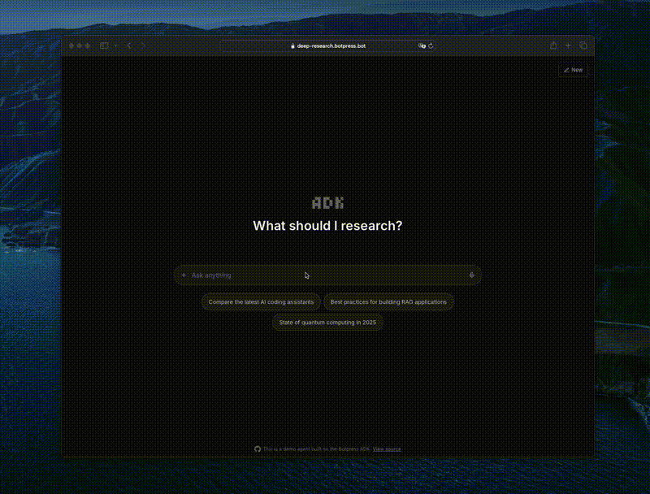

# Deep Research

An AI research agent that takes a topic, searches the web, reads pages, and produces a structured report with citations — all running as a background workflow with real-time progress updates in the UI.

## Demo

Try it live: **[https://deep-research.botpress.bot](https://deep-research.botpress.bot)**



## Use Case

When you need an agent that can autonomously research a topic end-to-end:

- Understand the topic landscape before deciding what to research
- Search, filter, and read relevant web pages
- Answer specific questions with citations from those pages
- Synthesize everything into a polished report with an executive summary

This example shows how to build a multi-phase research pipeline using durable workflow steps, parallel execution with `step.map`, and real-time progress tracking via custom messages.

## How It Works

The conversation handler starts the workflow and tracks it via `Reference.Workflow` in conversation state. The workflow runs independently in the background — the conversation discovers its result on the next incoming message by checking the workflow status.

The workflow writes progress to a custom message on the server (`custom://research_progress`). The frontend polls this message every 1s to pick up changes — the workflow and frontend never communicate directly.

Surface research runs first so the TOC is grounded in real findings, not assumptions. Sections are researched in parallel via `step.map` to stay within the 60-minute timeout. The final report is rewritten by the "best" model from the raw Q&A data for higher quality than assembling answers directly.

## Key Components

### Research Workflow (`bot/src/workflows/index.ts`)

A 6-phase durable workflow. Each phase is a `step()` that survives restarts. Key ADK primitives used: `zai.extract()` for structured data, `zai.filter()` for page selection, `zai.answer()` for cited Q&A, `zai.text()` for report writing, and `step.map()` for parallel section research.

### Activity Table (`bot/src/tables/research-activity.ts`)

Activities (searches, page reads, writing steps) are stored as table rows instead of in the message payload. This avoids race conditions from `step.map` — multiple parallel sections can log activities without conflicting on the same message.

### Progress Component (`bot/src/utils/progress-component.ts`)

Creates and updates a custom message with url `custom://research_progress`. The update function has merge semantics designed for concurrent callers: sources are deduplicated, progress only goes forward, and activities are fetched fresh from the table each call.

### Page Fetcher (`bot/src/utils/fetch-page.ts`)

Two-tier fetching strategy: native `fetch` first (fast, no integration overhead), then the browser integration as fallback for JS-rendered pages. Parses favicons from HTML on the native fetch path since the browser integration provides them automatically.

### Conversation Handler (`bot/src/conversations/index.ts`)

Manages the workflow lifecycle with dynamic tools — while research is running the AI only sees `stop_research`, otherwise it sees `web_search` + `start_research`. Switches to a vision-capable model if the user sends images.

### Frontend Polling (`frontend/src/hooks/useResearchPolling.ts`)

The webchat SDK doesn't push message payload changes, so the frontend polls the chat API every 1s for in-progress research messages and syncs updates into React context for the UI to re-render.

## Getting Started

1. Install dependencies:
   ```bash
   bun install
   ```

2. Start development server:
   ```bash
   adk dev
   ```

3. Deploy:
   ```bash
   adk deploy
   ```
